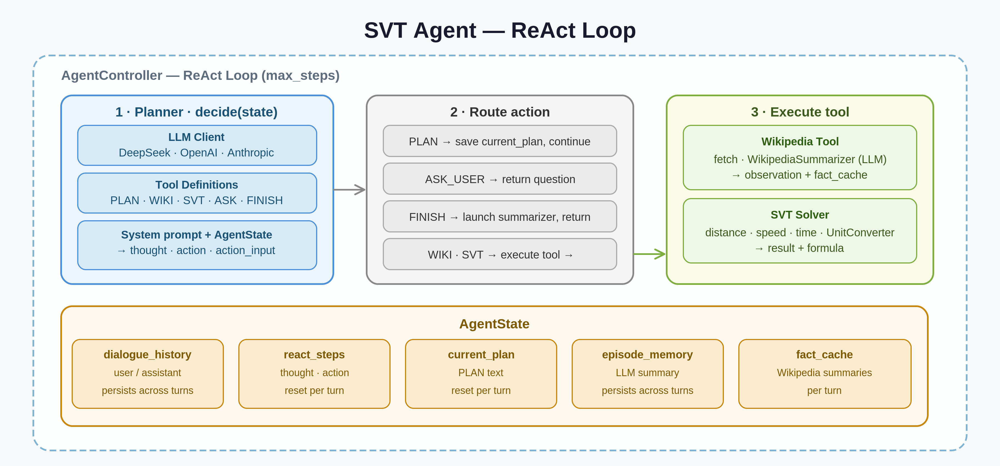

# 🤖 ReAct Cheetah 

**Interactive non-deterministic AI agent that answers distance-rate-time questions by fetching real-world data from Wikipedia and powered by a dedicated solver tool `s = v · t`**  

Query examples (see the list of test queries `svt_agent_test_cases.xlsx`)
- _Сколько времени гепард будет бежать по Большому Каменному мосту?_
- _За сколько поезд проедет по тоннелю под Ла-Маншем?_
- _Сколько Усейн Болту бежать от центра Лондона до Аэропорта Хитроу?_


The project demonstrates how adding a single `PLAN` command to the system prompt triggers structured reasoning and significantly boosts response quality  — even in smaller, less capable models

---

## 📋 Table of Contents

- [Quick Start](#-quick-start)
  - [Installing Dependencies](#installing-dependencies)
  - [Environment Configuration](#environment-configuration)
  - [Working with Requests](#working-with-requests)
  - [Run](#run)
- [Architecture](#%EF%B8%8F-architecture)
- [Future Work](#%EF%B8%8F-future-work)
---

## 🚀 Quick Start

### Installing Dependencies

```bash
# Clone the repository
git clone https://github.com/renessi/ReAct_Cheetah.git
cd ReAct_Cheetah

# Create and activate a virtual environment
python -m venv .venv
source .venv/bin/activate

# Install required packages (dependencies-free architecture)
pip install -r requirements.txt
```

> **Platform:** Ubuntu 20.04, Python 3.8+

---

### Environment Configuration

Copy the example environment file and fill in your values:

```bash
cp .env.example .env
```

```python
# .env
DEEPSEEK_API_KEY=your_key # or your model 
DEEPSEEK_BASE_URL=https://api.deepseek.com # or your model

LLM_PROVIDER=deepseek # or your model 
MODEL_NAME=deepseek-chat # or your model

VERBOSE=false # hide the output of the reasoning steps       
```

**Supported models**  

| Provider | Default Model | Notes |
|---|---|---|
| Deepseek | `deepseek-chat` | Recommended |
| Anthropic | `claude-haiku-4-5-20251001` | Faster response, worse quality |
| OpenAI | `gpt-5o-nano` | Faster response, worse quality |
| Any OpenAI compatible | — (any Tool Calling compatible) | — |

> Not recommended: The use of previous generation models (e.g. gpt 4) due to problems with tool calling and structured output.
---

### Working with Requests

Проект является исследовательским прототипом и не предназначен для коммерческого использования

**Ключевые особенности**

- Агент не отвечает на вопросы вне своей зоны работы
- Агент не отлавливает промпт-инъекции и не использует каких-либо других мер безопасности
- Время ответа от 10-40 с. (в зависимости от модели) для простых запросов (минимум 2 LLM вызова) и от 40-90 с. — для сложных (с рассуждением). Если агент отвечает больше 3-х минут, вероятнее всего, сервера провайдера перегружены
- Модели OpenAI и Anthropic чаще вызывают ASK_USER при работе с информацией на русском языке. Большой каменный мост можно заменить на Бруклинский мост
- Follow-up вопросы находятся в моковом режиме. При их использовании агент может начать галлюцинировать факты из весов, так как не предназначен для учета сложных моделей с ускорением, препятствиями и прочими усложнениями
- Уровень воспроизводимости для одних и тех же запросов (`temperature`) для всех моделей по умолчанию равен `0.3`. В одном из 10-20 случаев агент может дать ответ неудовлетворительного качества (см. раздел [Future Work](#%EF%B8%8F-future-work)), не уложиться в `max_steps` или зациклиться. В таком случае отравьте команду `продолжай`, дайте подсказку или перезапустите агента

### Run

Check all the tests
```python
pytest
```

Run
```python
python -m cli
```
---

## 🏗️ Architecture



### Tools
The agent operates with a strict tool contract: **Tool Calling + Structured Output + `tool_choice="required"`**

| Tool | Role |
|---|---|
| `plan` | Decomposes complex queries into ordered steps |
| `wiki` | Sole data source — no model weights used for facts |
| `compute_svt` | Evaluates `s = v · t` and its derivatives |
| `ask_user` | Requests clarification when query is ambiguous |
| `finish` | Stop condition. Generates the final answer and follow-up questions |

### Agent Loop
- **Planner** is decoupled from **Controller** (executor) — plan is generated once, execution is step-by-step
- Maximum steps are capped via `max_steps` to prevent infinite loops

### LLM Backends
Two providers supported:
- **OpenAI-compatible** clients (three default models)
- **Anthropic** client

### Memory
| Layer | Implementation |
|---|---|
| Working memory | `react_steps` — current reasoning trace |
| Episodic memory | Long-term storage across sessions |

**Async process:** Upon FINISH, a background thread is launched to summarize the turn's 
reasoning: search strategy, facts retrieved, assumptions made, and 
difficulties encountered. The summary runs concurrently while the user 
reads the response. The next turn waits for it to complete before starting. Simple queries are not summarized via background LLM call, instead a snapshot is taken.

### Latency-Quality tradeoff
- Model choice directly affects the latency-quality tradeoff
- Routing separates **simple queries** (fast, no plan) from **complex queries** (full planning loop) — currently injected in system prompt

### Prompts

- **System prompt:** planner/planner.py
- **Wiki summarizer prompt:** memory/wikipedia_summarizer.py
- **Reasoning steps summarizer:** memory/episode_memory.py

Prompt Design Principles:

- High abstraction, minimum heuristics, maximum generalization
- Few-shot prompting intentionally avoided — the agent is expected to reason, not pattern-match
- Autonomy and user interaction are balanced: clarification is requested only when ambiguity cannot be resolved independently

---

## 🗺️ Future Work

| Feature | Description |
|---|---|
| **Wiki Tool** | • Infobox fetching from Wikipedia<br>• Intelligent chunking of article content<br>• Improved query formation logic for better retrieval accuracy |
| **Solver Tool** | • Dynamic tool generation for mathematical formulas (Haversine, acceleration, etc.)<br>• Replacement of the rule-based unit-conversion engine with a model-driven approach |
| **Latency Optimization** | • Multi-threading for parallel tool execution<br>• Streaming responses to reduce perceived latency<br>• Routing lightweight queries<br> |
| **Quality Optimization** | • Supervised Fine-Tuning (SFT) on domain-specific data and quiries<br>• Chain-of-Thought (CoT) prompting<br>• Chain-of-Verification (CoVe) for factual accuracy<br> • REPLAN tool |
| **Memory** | • Migration from in-memory to persistent disk-based storage<br>• Context-aware retriever for injecting relevant history into prompts |
| **Routing** | • Balanced dispatching between deep-think and fast-response modes<br>• Intent classification for accurate tool selection<br>• Graceful handling of out-of-scope conversational turns |
| **Test Automation** | • LLM-as-a-judge evaluation framework for automated answer scoring |
| **Repo Refactor** | • LangChain integration for client management, logging, metrics collection, and data preprocessing |
| **UX / UI** | • Cloud deployment <br>• Telegram bot interface<br>
